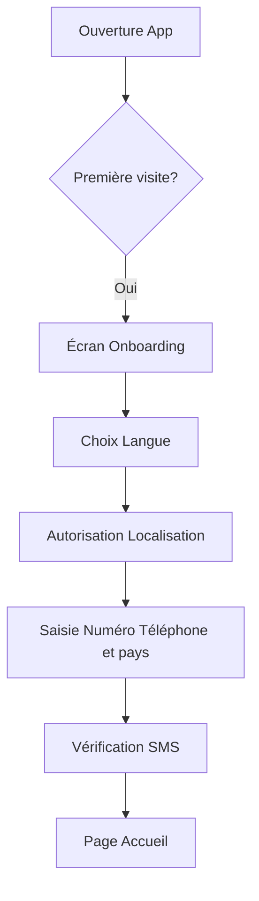
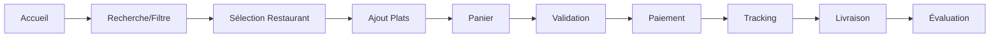

# 🍽️ Module 1 : Service Repas/Restaurants

## Entités et Propriétés

### Restaurant
```yaml
Informations de base:
  - nom: String
  - logo: Image (compression adaptative)
  - bannière: Image (lazy loading)
  - description: Text (200 caractères max)
  - catégorie_cuisine: Enum [Locale, Internationale, Fast-food, Street-food, Végétarien]
  - certifications: Array [Halal, Bio, Hygiène A+]

Localisation:
  - coordonnées_GPS: {lat, lng}
  - adresse_complète: String
  - quartier: String
  - repères_locaux: Array<String>
  - zone_livraison: Polygon
  - distance_max: Number (km)

Horaires:
  - horaires_semaine: Object {lundi-dimanche: {ouverture, fermeture}}
  - pauses: Array<{début, fin}>
  - jours_fermés: Array<Date>
  - statut_temps_réel: Enum [Ouvert, Fermé, Pause, Complet]

Service:
  - temps_préparation_moyen: Number (minutes)
  - temps_livraison_estimé: Function(distance)
  - minimum_commande: Number (devise locale)
  - frais_livraison: Function(distance, heure)
  - modes_paiement: Array [MobileMoney, Cash, Carte, Portefeuille]

Engagement:
  - note_moyenne: Float (0-5)
  - nombre_avis: Integer
  - taux_acceptation: Percentage
  - temps_réponse_moyen: Number (secondes)
  - badges: Array [Rapide, Fiable, PopulaireSemaine]
```

### Plat
```yaml
Informations:
  - nom: String
  - images: Array<Image> (carousel)
  - description: Text
  - catégorie: Enum [Entrée, Plat, Dessert, Boisson, Accompagnement]
  - tags: Array [Épicé, Végétarien, Sans gluten, Local]

Tarification:
  - prix_base: Number
  - tailles: Object {small, medium, large, family}
  - options_payantes: Array<{nom, prix}>
  - promotions: Object {type, valeur, conditions}

Personnalisation:
  - garnitures: Array<{nom, prix, disponible}>
  - niveau_piment: Scale (0-3)
  - cuisson: Enum [Saignant, À point, Bien cuit]
  - sans: Array [Oignon, Ail, Sel, Sucre]
  - suppléments: Array<{nom, prix, quantité_max}>

Disponibilité:
  - stock_actuel: Number
  - disponible: Boolean
  - temps_préparation: Number (minutes)
  - déjà_prêt: Boolean
  - service: Array [Petit-déjeuner, Déjeuner, Goûter, Dîner]
  - jours_disponibles: Array<Day>

Nutrition (optionnel):
  - calories: Number
  - protéines: Number (g)
  - glucides: Number (g)
  - lipides: Number (g)
  - allergènes: Array<String>
```

## 🎯 Parcours Utilisateur : Commander un Repas

### Parcours 1 : Première Commande (Nouvel Utilisateur)



**Étapes Détaillées :**

1. **Onboarding (3 écrans max)**
   - Écran 1 : "Bienvenue ! Commandez vos plats préférés"
   - Écran 2 : "Livraison rapide dans votre quartier"
   - Écran 3 : "Payez comme vous voulez"
   - [Skip possible à tout moment]

2. **Configuration Initiale**
   - Sélection langue (avec drapeaux visuels)
   - Demande GPS : "Pour trouver les restaurants près de vous"
   - Si refus GPS → Saisie manuelle quartier/zone
   - Numéro de téléphone → Code SMS à 4 chiffres

3. **Page d'Accueil**
   - Bannière promo du jour
   - Catégories en icônes (Repas et icons des autres catégorie)
   - "Près de vous" avec restaurants < 5km(modifiable): cette option concerne uniquement certaines catégorie
   - Barre de recherche avec suggestion vocale

### Parcours 2 : Commande Rapide (Utilisateur Habitué)



**Étapes Détaillées :**

1. **Recherche et Découverte** (30 sec)
   - Barre de recherche : tape ou dicte "Pizza"
   - Filtres rapides : Prix (€/€€/€€€), Distance, Note, Temps
   - Tri : Pertinence, Plus proche, Plus rapide, Mieux noté
   - Résultats avec badges visuels (🔥 Populaire, ⚡ Rapide, 💰 Promo)

2. **Page Restaurant** (45 sec)
   - Header : Photo, nom, note, temps estimé, frais livraison
   - 3 onglets : Menu | Avis | Infos
   - Menu groupé par catégories avec prix visibles
   - Bouton flottant : "Voir panier (3)" si articles ajoutés

3. **Sélection Plat** (20 sec)
   - Photo grande qualité
   - Prix dynamique selon options
   - Personnalisation simple :
     * Taille : [S] [M] [L] [XL]
     * Piment : 🌶️ [0][1][2][3]
     * Garnitures : Cases à cocher avec prix
   - Quantité : [-] 1 [+]
   - Bouton : "Ajouter 15.000 FCFA"

4. **Panier** (30 sec)
   - Liste des articles avec prix
   - Modification quantité en ligne
   - Code promo (optionnel)
   - Sous-total + Frais livraison = Total
   - Note pour le restaurant (optionnel)
   - Bouton : "Commander"

5. **Validation Commande** (20 sec)
   - Adresse livraison (GPS ou saisie)
   - Ajout repères : "Maison bleue près de l'école"
   - Heure souhaitée : Maintenant / Programmer
   - Récapitulatif avec temps estimé

6. **Paiement** (30 sec)
   - Options visuelles :
     * 💵 Cash à la livraison
     * 📱 Orange/MTN/Moov Money (API)
     * 💳 Carte bancaire(API)
     * 👛 Mon portefeuille (solde affiché)
   - Confirmation : "Paiement en cours..."

7. **Tracking Temps Réel** (durée livraison)
   - Timeline visuelle :
     * ✅ Commande confirmée
     * 👨‍🍳 En préparation (15 min)
     * 🚴 En route (20 min)
     * 📍 Arrivé
   - Carte avec position livreur
   - Chat/Appel avec restaurant et livreur
   - Notifications push à chaque étape

8. **Réception** (1 min)
   - Code de confirmation à 2 Lettre uniquement en majuscule(exemple: "A9")
   - Photo de la livraison (optionnel)
   - Confirmation de réception

9. **Évaluation** (30 sec)
   - Note rapide : ⭐⭐⭐⭐⭐
   - Tags prédéfinis : "Délicieux", "Rapide", "Chaud", "Bien emballé"
   - Commentaire (optionnel)
   - Pourboire livreur (optionnel)