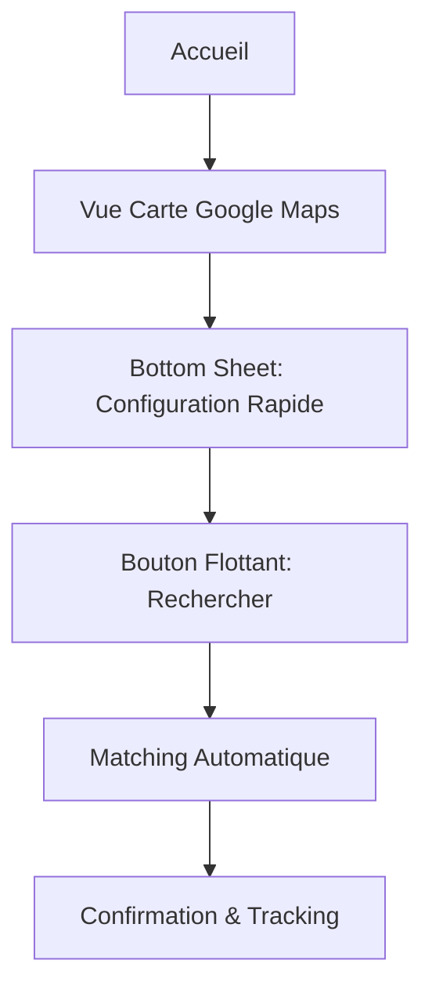

# 🚴 Module 2 : Service Livraison/Coursier

## Entités et Propriétés

### Livreur
```yaml
Profil:
  - nom_complet: String
  - photo: Image (vérifiée)
  - pièce_identité: Document (crypté, non visible)
  - document_valide: Boolean
  - téléphone: String (vérifié)
  - email: String (optionnel)

Véhicule:
  - type: Enum [Piéton, Vélo, Moto, Tricycle, Voiture, Camion]
  - marque_modèle: String
  - couleur: String
  - immatriculation: String
  - photos: Array<Image> (4 angles)
  - assurance: Boolean + Document
  - capacité_charge: Number (kg)

Performance:
  - note_moyenne: Float (0-5)
  - nombre_livraisons: Integer
  - taux_réussite: Percentage
  - ponctualité: Percentage
  - badges: Array [Rapide, Soigneux, Professionnel]

Préférences:
  - zones_service: Array<Zone>
  - types_colis_acceptés: Array<Type>
  - horaires_disponibilité: Schedule
  - distance_max: Number (km)
```

### Commande Simple
```yaml
Trajets:
  - point_départ: {GPS, adresse}
  - points_destinations: Array<Point> (flexibles)
  - distance_totale: Number (km)
  - durée_estimée: Number (minutes)

Paramètres:
  - nombre_colis: Integer
  - type_véhicule_souhaité: Enum [Piéton, Vélo, Moto, Tricycle, Voiture, Camion]
  - mode_paiement: Enum [Mobile Money, Espèces, Carte]
  - prix_estimé: Number (FCFA)
```

## 🎯 Interface Ultra-Simple : Carte + Bottom Sheet

### Parcours Simplifié



### Interface Principale

**1. Carte Google Maps (Écran principal)**
- Vue centrée sur la position utilisateur
- Pins des livreurs disponibles en temps réel
- Couleurs différentes par type de véhicule :
  * 🚶 Vert : Piéton
  * 🚲 Bleu : Vélo
  * 🏍️ Orange : Moto
  * 🚗 Rouge : Voiture
  * 🚚 Très rouge: Camion
- Zoom/déplacement pour explorer la zone

**2. Bottom Sheet (En bas de l'écran)**
Configuration ultra-rapide en 5 éléments :

```yaml
Sélections rapides:
  📍 Point de départ: [Ma position] [Autre adresse]
  📦 Nombre de colis: [1] [2] [3] [4+]
  🏍️ Type véhicule: [Piéton] [Vélo] [Moto] [Voiture] [Camion]  [Indifférent] ()
  💳 Paiement: [Mobile Money] [Espèces] [Carte]
  🎯 Destinations: [+ Ajouter des arrêts]
```

**3. Bouton Flottant (Action principale)**
- Bouton circulaire "Rechercher un livreur"
- Affichage prix estimé en temps réel
- Animation de recherche au clic

### Flux Ultra-Rapide (< 2 minutes)

1. **Ouverture** (5 sec)
   - Carte s'affiche avec livreurs visibles
   - Bottom sheet déjà configuré par défaut

2. **Configuration** (30 sec)
   - Ajuster point de départ si nécessaire (position actuel sélectionné par défaut)
   - Sélectionner nombre de colis (par défaut : 1)
   - Choisir type de véhicule (par défaut : Indifférent)
   - Ajouter destinations avec pins sur carte, le nombre de destination
   - pour chaque destination, 

3. **Recherche** (15 sec)
   - Appui sur bouton flottant
   - Matching automatique basé sur :
     * Proximité
     * Type véhicule sélectionné
     * Prix compétitif
   - Proposition immédiate du meilleur livreur

4. **Confirmation** (30 sec)
   - Carte du livreur sélectionné
   - Prix final affiché
   - Boutons : "Confirmer" ou "Autre livreur"

5. **Tracking** (durée trajet)
   - Suivi en temps réel sur la carte
   - Notifications push automatiques
   - Contact direct livreur si nécessaire