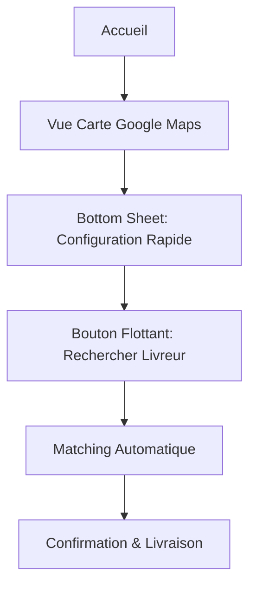

# ⛽ Module 3 : Service Recharge Gaz

## Entités et Propriétés

### Station/Magasin Gaz
```yaml
Profil:
  - nom: String
  - position: {GPS, adresse}
  - photo: Image

Stock:
  - bouteilles_6kg: {stock, prix, marque}
  - bouteilles_12kg: {stock, prix, marque}
  - bouteilles_25kg: {stock, prix, marque}
  - bouteilles_50kg: {stock, prix, marque}
```

### Commande Gaz
```yaml
Paramètres:
  - type_opération: Enum [Achat, Recharge]
  - nombre_bouteilles: Integer
  - type_véhicule: String (auto-sélectionné)
  - mode_paiement: Enum [Mobile Money, Espèces]
  - destination: {GPS, adresse}
```

## 🎯 Interface Ultra-Simple : Carte + Bottom Sheet

### Parcours Simplifié



### Interface Principale

**1. Carte Google Maps (Écran principal)**
- Vue centrée sur la position utilisateur
- Pins des stations/magasins de gaz disponibles
- Couleurs différentes par type de stock :
  * 🟢 Vert : Stock complet
  * 🟡 Orange : Stock limité
  * 🔴 Rouge : Rupture de stock
- Zoom/déplacement pour explorer la zone

**2. Bottom Sheet (En bas de l'écran)**
Configuration ultra-rapide en 5 éléments :

```yaml
Sélections rapides:
  🔄 Opération: [Achat] [Recharge]
  ⛽ Bouteilles: Image bouteille avec [+] [-] pour quantité
  🏷️ Marque: [Total] [Shell] [Oryx] [Autre]
  💳 Paiement: [Mobile Money] [Espèces]
  📍 Destination: [Ma position] [Autre adresse]
```

**3. Bouton Flottant (Action principale)**
- Bouton circulaire "Rechercher un livreur"
- Affichage prix estimé en temps réel
- Animation de recherche au clic

### Flux Ultra-Rapide (< 1 minute)

1. **Ouverture** (5 sec)
   - Carte s'affiche avec stations visibles
   - Bottom sheet configuré par défaut (Recharge, 1 bouteille)

2. **Configuration** (20 sec)
   - Choisir opération : Achat ou Recharge
   - Ajuster nombre de bouteilles avec +/-
   - Type véhicule sélectionné automatiquement selon quantité
   - Confirmer destination

3. **Recherche** (10 sec)
   - Appui sur bouton flottant
   - Matching automatique du livreur
   - Proposition immédiate

4. **Confirmation** (15 sec)
   - Prix final affiché
   - Bouton "Confirmer la commande"

5. **Livraison** (durée du trajet)
   - Tracking en temps réel
   - Notification à l'arrivée