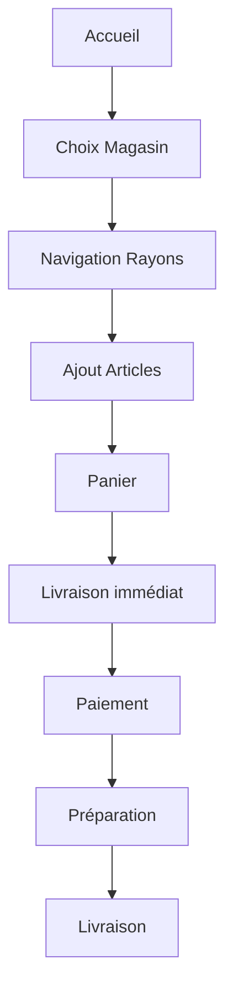

# 🛒 Module 4 : Service Boutique/Supermarché

## 🎯 Parcours Utilisateur : Courses en Ligne

### Parcours : Liste de Courses Familiale

**Étapes Détaillées :**

1. **Sélection Magasin** (20 sec)
   - Géolocalisation : Magasins proches
   - Filtres : Supermarché, Épicerie, Spécialisé, marché local
   - Infos : Distance, frais, minimum commande
   - Favoris en premier

2. **Navigation Produits** (5 min)
   - Rayons visuels :
     * 🥖 Boulangerie
     * 🥩 Boucherie
     * 🥛 Produits laitiers
     * 🥦 Fruits & Légumes
   - Barre de recherche intelligente
   - Filtres : Prix, Marque, Promo
   - "Mes habitudes" : Produits fréquents

3. **Ajout au Panier** (continu)
   - Photo produit + prix au kg/unité
   - Quantité : [−] 1 [+] ou saisie directe
   - Alternatives proposées si rupture
   - Total panier visible en permanence

4. **Gestion Panier** (2 min)
   - Révision des articles
   - "Sauvegarder liste" pour prochaine fois
   - Application des promotions
   - Vérification minimum commande

5. **Livraison** (1 min)
   - Créneaux de 2h disponibles
   - Option "Réception par gardien"
   - Sacs réutilisables (optionnel)

6. **Suivi Commande** (10 min - 2h)
   - Statut : Préparation → En route → Arrivé
   - Chat avec personal shopper
   - Validation substitutions
   - Ajout dernière minute possible