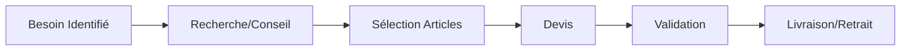

# 🔧 Module 5 : Service Quincaillerie

## 🎯 Parcours Utilisateur : Achat Matériel

### Parcours : Projet Bricolage

**Étapes Détaillées :**

1. **Identification Besoin** (1 min)
   - Catégories visuelles :
     * 🔨 Outils
     * 🚰 Plomberie
     * ⚡ Électricité
     * 🎨 Peinture
     * 🪜 Location matériel
   - "Besoin d'aide ?" → Chat/Vidéo avec expert

2. **Recherche Assistée** (3 min)
   - Description du projet
   - Suggestions de matériel nécessaire
   - Tutoriels vidéo intégrés
   - Calculateurs (peinture/m², câbles, etc.)

3. **Constitution Panier** (5 min)
   - Vérification compatibilité articles
   - Options location vs achat
   - Quantités suggérées selon projet
   - Prix dégressifs pour volume

4. **Devis Détaillé** (2 min)
   - PDF téléchargeable
   - Validité 7 jours
   - Option "Demander conseil pro"
   - Partage WhatsApp possible

5. **Finalisation** (2 min)
   - Livraison (délai selon poids)
   - Retrait magasin (prêt en 2h)
   - Option : Mise en relation artisan