# 🔧 Application Admin - Plateforme de Gestion

## 🎯 Vision
Application de gestion centralisée permettant aux administrateurs de monitorer, gérer et optimiser l'ensemble de l'écosystème de services, avec des outils d'analyse avancés et une gestion proactive des opérations.

## 🌟 Caractéristiques Principales
- **Monitoring temps réel** de toutes les activités
- **Gestion multi-niveaux** des utilisateurs et permissions
- **Analytics avancés** avec IA prédictive
- **Automatisation** des processus répétitifs
- **Système d'alertes** intelligent

---

## 👥 Structure Administrative

### Hiérarchie des Rôles

```yaml
Super Admin:
  - Accès total système
  - Configuration globale
  - Gestion autres admins
  - Données financières sensibles

Admin Régional:
  - Gestion zone géographique
  - Validation prestataires
  - Support niveau 2
  - Rapports régionaux

Admin Opérationnel:
  - Monitoring quotidien
  - Support niveau 1
  - Gestion litiges basiques
  - Actions correctives

Admin Support:
  - Réponse tickets
  - Assistance utilisateurs
  - Documentation
  - Formation

Admin Finance:
  - Transactions
  - Réconciliation
  - Rapports fiscaux
  - Gestion fraudes
```

---

## 🏠 Module Dashboard Principal

### Interface d'Accueil

```yaml
Dashboard Global:
  header:
    - système_santé: [Optimal/Dégradé/Critique]
    - alertes_actives: Count + Priorité
    - utilisateurs_en_ligne: Number
    
  métriques_temps_réel:
    - commandes_minute: Number + Trend
    - GMV_jour: Amount + %vs.hier
    - nouveaux_utilisateurs: Count
    - taux_completion: Percentage
    
  carte_live:
    - heat_map_activités: Zones chaudes
    - livreurs_actifs: Points GPS
    - incidents: Markers rouges
    - zones_croissance: Overlay vert
    
  graphiques:
    - revenus_7j: Line chart
    - répartition_services: Pie chart
    - performance_heures: Bar chart
    - satisfaction_trend: Area chart
```

### 🎯 Parcours : Monitoring Quotidien

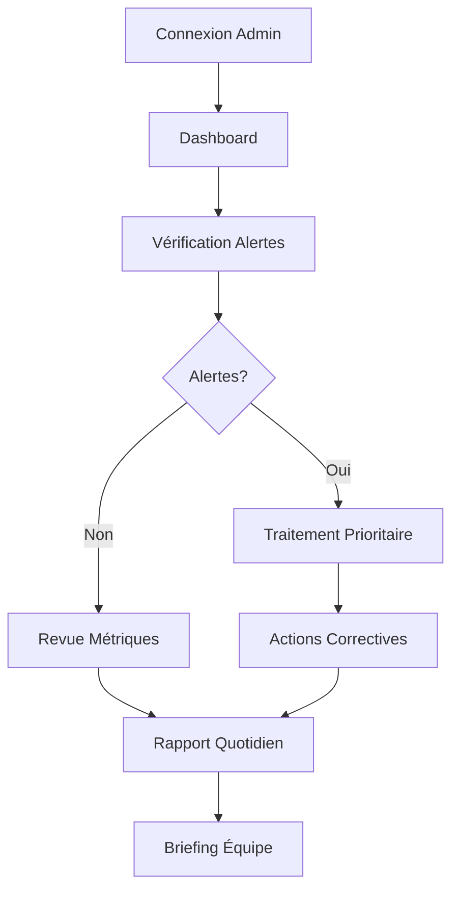

**Étapes Détaillées :**

1. **Connexion Sécurisée** (30 sec)
   - **Authentification Multi-facteurs :**
     * Email/Username
     * Mot de passe fort
     * Code 2FA (SMS/App)
     * Biométrie (optionnel)
   
   - **Vérifications :**
     * IP whitelistée
     * Device reconnu
     * Session limitée (8h)
     * Log connexion

2. **Vue d'Ensemble** (2 min)
   - **Check Système :**
     ```
     SANTÉ SYSTÈME - 04/09/2025 08:00
     
     ✅ Serveurs: 99.9% uptime
     ✅ Base données: 45ms latence
     ⚠️ API Paiement: Ralentissement
     ✅ CDN: Opérationnel
     
     Performance:
     - Requêtes/sec: 2,847
     - Temps réponse: 230ms
     - Erreurs: 0.02%
     
     [DÉTAILS] [LOGS] [ALERTES]
     ```

3. **Gestion Alertes** (5 min)
   - **Types d'Alertes :**
     * 🔴 Critique : Panne service
     * 🟠 Haute : Performance dégradée
     * 🟡 Moyenne : Seuil atteint
     * 🔵 Info : Notification
   
   - **Actions Rapides :**
     * Acknowledge → Assign → Resolve
     * Escalade automatique si non traité
     * Communication parties prenantes

4. **Analyse Métriques** (10 min)
   - **KPIs Principaux :**
     * GMV (Gross Merchandise Value)
     * Taux conversion
     * CAC vs LTV
     * Churn rate
     * NPS score
   
   - **Drill-down :**
     * Par service
     * Par région
     * Par segment client
     * Par période

---

## 👤 Module Gestion Utilisateurs

### 🎯 Parcours : Validation Nouveau Prestataire

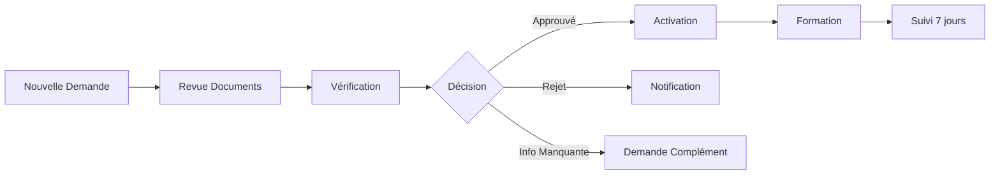

**Étapes Détaillées :**

1. **File d'Attente** (vue)
   ```
   DEMANDES EN ATTENTE (47)
   
   Filtres: [Tous] [Restaurant] [Livreur] [Commerce]
   Tri: [Plus récent] [Plus ancien] [Zone]
   
   ┌─────────────────────────────────┐
   │ 🍴 Restaurant Chez Fatou        │
   │ Soumis: Il y a 2h               │
   │ Type: Restaurant local          │
   │ Zone: Yopougon                  │
   │ Documents: 4/4 ✓               │
   │ [EXAMINER]                      │
   └─────────────────────────────────┘
   ```

2. **Examen Détaillé** (3 min)
   - **Vérifications Automatiques :**
     * ✓ Documents complets
     * ✓ Registre commerce valide
     * ✓ Pas de doublon
     * ⚠️ Adresse à vérifier
   
   - **Review Manuelle :**
     * Photos local (zoom)
     * Cohérence informations
     * Recherche Google/réseaux
     * Appel vérification

3. **Process Décision** (1 min)
   - **Si Approuvé :**
     * Statut → Actif
     * Email bienvenue
     * Accès formation
     * Attribution badge "Nouveau"
   
   - **Si Rejeté :**
     * Motif détaillé
     * Possibilité recours
     * Suggestions amélioration
   
   - **Si Incomplet :**
     * Liste éléments manquants
     * Délai 7 jours
     * Relance auto J+3

4. **Suivi Post-Activation** (7 jours)
   - **Monitoring Automatique :**
     * Première commande
     * Taux complétion
     * Note moyenne
     * Support demandé
   
   - **Actions Proactives :**
     * Appel J+1 : "Tout va bien ?"
     * Check J+3 : Premières commandes
     * Bilan J+7 : Ajustements

### 🎯 Parcours : Gestion Compte Problématique

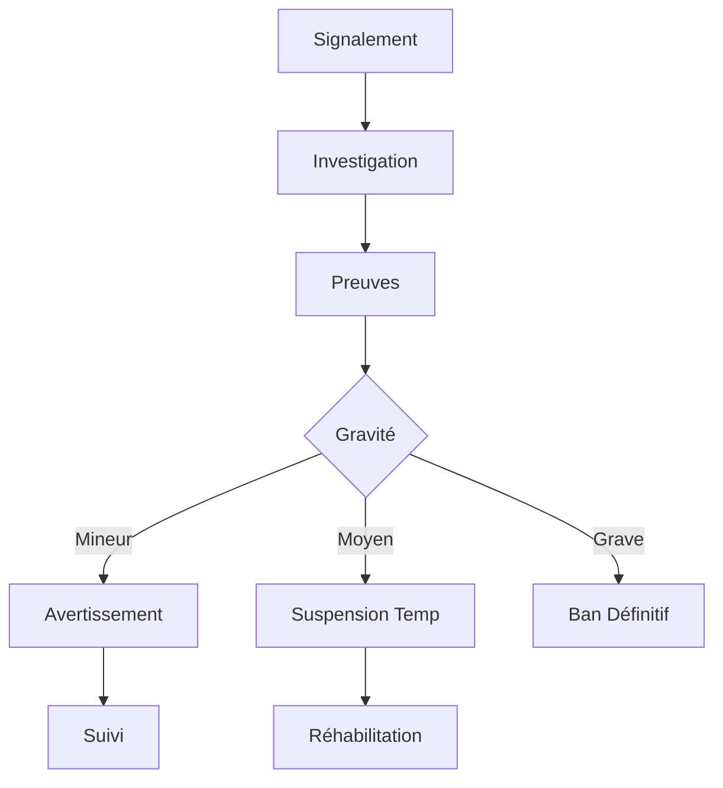

**Étapes Détaillées :**

1. **Détection Problème** (sources)
   - Plaintes clients (>3)
   - Note chute (<3.5)
   - Fraude détectée
   - Comportement suspect
   - Violation CGU

2. **Investigation** (30 min)
   - **Collecte Données :**
     * Historique compte
     * Logs d'activité
     * Communications
     * Preuves (screenshots, etc.)
   
   - **Analyse Pattern :**
     * Récurrence
     * Intentionnalité
     * Impact business
     * Risque réputation

3. **Actions Graduées**
   - **Niveau 1 - Avertissement :**
     * Email formel
     * Rappel règles
     * Formation obligatoire
   
   - **Niveau 2 - Restriction :**
     * Limitation zones
     * Plafond transactions
     * Surveillance accrue
   
   - **Niveau 3 - Suspension :**
     * Durée : 3/7/30 jours
     * Conditions retour
     * Perte avantages
   
   - **Niveau 4 - Ban :**
     * Fermeture définitive
     * Blacklist dispositif
     * Note dossier légal

---

## 📊 Module Analytics Avancé

### 🎯 Parcours : Génération Rapport Mensuel

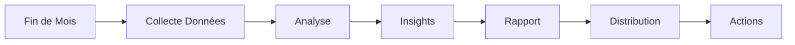

**Étapes Détaillées :**

1. **Configuration Rapport** (2 min)
   - **Paramètres :**
     ```
     RAPPORT MENSUEL - NOVEMBRE 2024
     
     Période: 01/11 - 30/11
     Segments: ☑️ Tous
     Comparaison: vs Octobre, vs Nov 2023
     
     Sections:
     ☑️ Performance Globale
     ☑️ Par Service  
     ☑️ Par Région
     ☑️ Finances
     ☑️ Utilisateurs
     ☑️ Incidents
     
     Format: [PDF] [Excel] [Dashboard]
     
     [GÉNÉRER]
     ```

2. **Analyse Automatique** (5 min)
   - **IA Processing :**
     * Calculs métriques
     * Détection anomalies
     * Tendances significatives
     * Corrélations
     * Prédictions

3. **Review et Enrichissement** (15 min)
   - **Insights Clés :**
     * Top achievements
     * Problèmes récurrents
     * Opportunités identifiées
     * Risques potentiels
   
   - **Recommandations :**
     * Actions prioritaires
     * Investissements suggérés
     * Optimisations process
     * Focus zones

4. **Distribution** (5 min)
   - **Audiences :**
     * Board : Executive summary
     * Managers : Rapport détaillé
     * Équipes : KPIs pertinents
   
   - **Formats :**
     * Email automatique
     * Slack/Teams notification
     * Dashboard interactif
     * Présentation PPT

### 🎯 Parcours : Analyse Prédictive

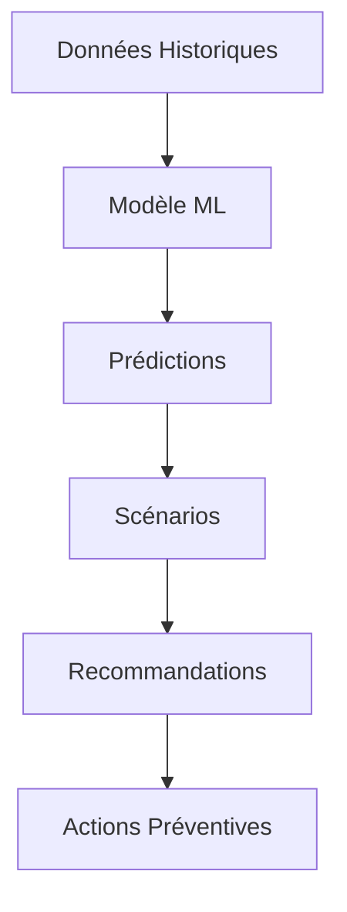

**Cas d'Usage :**

1. **Prédiction Demande**
   - **Input Data :**
     * Historique 12 mois
     * Événements calendrier
     * Météo prévue
     * Tendances marché
   
   - **Output :**
     ```
     PRÉDICTION DEMANDE - SEMAINE 37
     
     Lundi: +15% vs moyenne
        → Rentrée scolaire
     
     Vendredi: +45% vs moyenne
        → Jour de paie + Match CAN
     
     Recommendations:
     • Alerter 50 livreurs supplémentaires
     • Stock x1.5 restaurants zone Nord
     • Promo préventive jeudi
     
     Confiance: 87%
     ```

2. **Détection Fraude**
   - Patterns suspects
   - Score de risque
   - Blocage automatique
   - Investigation flag

3. **Churn Prediction**
   - Utilisateurs à risque
   - Causes probables
   - Actions rétention
   - Success rate

---

## 💰 Module Finance & Comptabilité

### 🎯 Parcours : Réconciliation Quotidienne

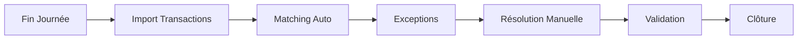

**Étapes Détaillées :**

1. **Import Automatique** (10 min)
   - **Sources :**
     * API Mobile Money (4 providers)
     * Logs app transactions
     * Relevés bancaires
     * Cash reports livreurs
   
   - **Volume Exemple :**
     ```
     IMPORT 03/09/2025
     
     Orange Money: 3,847 transactions
     MTN Money: 2,983 transactions
     Cash: 1,245 transactions
     Carte: 432 transactions
     
     Total: 8,507 transactions
     Montant: 42,750,000 FCFA
     
     [COMMENCER RÉCONCILIATION]
     ```

2. **Matching Automatique** (30 min)
   - **Algorithme :**
     * Match par référence
     * Match par montant+time
     * Match probabiliste
   
   - **Résultats :**
     * ✅ 8,234 matchés (96.8%)
     * ⚠️ 273 exceptions (3.2%)

3. **Traitement Exceptions** (45 min)
   - **Types Courants :**
     * Timeout paiement
     * Double paiement
     * Montant incorrect
     * Référence manquante
   
   - **Actions :**
     * Investigation logs
     * Contact provider
     * Ajustement manuel
     * Remboursement

### 🎯 Parcours : Gestion Commissions

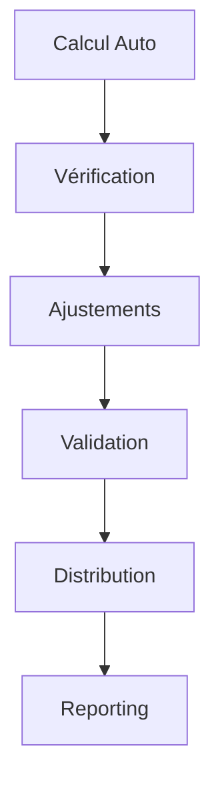

**Process :**

1. **Structure Commissions**
   ```
   GRILLE TARIFAIRE - Q4 2025
   
   Service Base:
   • Restaurants: 20% commande
   • Livraison: 15% course
   • Commerce: 18% transaction
   • Gaz: 10% vente
   
   Bonus Performance:
   • Note 4.5+: -2%
   • Volume 500+/mois: -3%
   • Exclusivité: -5%
   
   Pénalités:
   • Annulation: +50 FCFA
   • Retard: +100 FCFA
   • Plainte validée: +200 FCFA
   ```

2. **Calcul et Distribution**
   - Calcul temps réel
   - Cumul journalier
   - Validation fin de période
   - Virement automatique
   - Facture générée

---

## 🚨 Module Gestion de Crise

### 🎯 Parcours : Incident Majeur

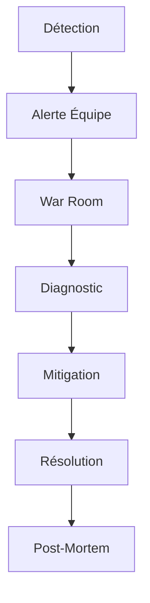

**Protocole de Crise :**

1. **Détection et Alerte** (< 1 min)
   - **Triggers Automatiques :**
     * Erreurs > 5%
     * Latence > 2s
     * Downtime service
     * Volume anormal
   
   - **Notification :**
     ```
     🚨 ALERTE CRITIQUE 🚨
     
     Service: API Paiement
     Impact: 2,400 users
     Début: 14:23
     
     Symptômes:
     - Timeout 80% requêtes
     - Error 500 sur /payment
     
     ÉQUIPE MOBILISÉE:
     - Tech Lead: @Jean
     - DevOps: @Marie
     - Support: @Paul
     
     War Room: meet.google.com/xxx
     
     [REJOINDRE] [DÉTAILS]
     ```

2. **War Room Virtuelle** (durée incident)
   - **Organisation :**
     * Incident Commander
     * Tech team
     * Communication
     * Business impact
   
   - **Actions :**
     * Diagnostic root cause
     * Mitigation immédiate
     * Communication users
     * Fix déploiement
     * Monitoring retour

3. **Communication Crise**
   - **Templates Prêts :**
     * SMS utilisateurs affectés
     * Message in-app
     * Email partenaires
     * Réseaux sociaux
   
   - **Updates Réguliers :**
     * Toutes les 30 min
     * Transparent sur impact
     * ETA résolution
     * Compensation si applicable

4. **Post-Mortem** (J+1)
   - Timeline complète
   - Root cause analysis  
   - Impact business
   - Actions préventives
   - Documentation

---

## 🤖 Module Automatisation

### 🎯 Parcours : Création Workflow

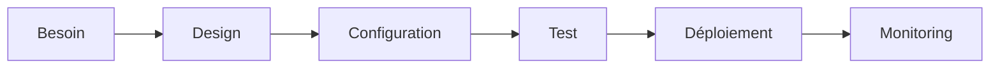

**Exemples de Workflows :**

1. **Auto-Modération Avis**
   ```yaml
   Trigger: Nouvel avis posté
   
   Conditions:
     - IF contains_keywords(insultes) 
       THEN hide + flag_review
     - IF rating < 2 AND verified_order = false
       THEN request_proof
     - IF positive_sentiment AND rating > 4
       THEN auto_publish + notify_merchant
   
   Actions:
     - Log decision
     - Update stats
     - Notify if needed
   ```

2. **Gestion Stock Intelligent**
   ```yaml
   Trigger: Stock < seuil
   
   Process:
     1. Check historique ventes
     2. Calculate optimal_reorder
     3. IF supplier_available
        THEN auto_order
        ELSE notify_manager
     4. Update projections
     5. Adjust pricing if needed
   ```

3. **Onboarding Automatisé**
   - Welcome series emails
   - Progressive activation
   - Gamification rewards
   - Retention triggers

### Règles Business Configurables

| Règle | Défaut | Personnalisable |
|-------|--------|-----------------|
| Commission minimum | 15% | Par région/service |
| Délai paiement | 7 jours | Par tier prestataire |
| Rayon livraison max | 10 km | Par zone urbaine/rurale |
| Temps réponse support | 2h | Par priorité client |
| Seuil fraude | Score 75 | Par type transaction |

---

## 🗺️ Module Expansion Géographique

### 🎯 Parcours : Lancement Nouvelle Ville

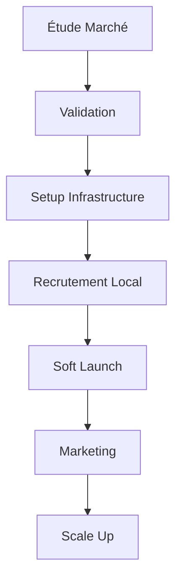

**Checklist Lancement :**

1. **Pré-Launch (8 semaines avant)**
   - [ ] Étude de marché complète
   - [ ] Partenaires locaux identifiés
   - [ ] Équipe locale recrutée
   - [ ] Infrastructure technique
   - [ ] Licences obtenues
   - [ ] Marketing plan

2. **Soft Launch (2 semaines)**
   - [ ] 50 restaurants partenaires
   - [ ] 100 livreurs actifs
   - [ ] Tests internes
   - [ ] Beta users (500)
   - [ ] Feedback collection
   - [ ] Adjustments

3. **Launch (Jour J)**
   - [ ] Campagne marketing
   - [ ] PR local
   - [ ] Promotions agressives
   - [ ] Support renforcé
   - [ ] Monitoring 24/7

4. **Post-Launch (4 semaines)**
   - [ ] Optimisations
   - [ ] Expansion zones
   - [ ] Nouveaux partenaires
   - [ ] Analyse ROI
   - [ ] Plan scale-up

---

## 🛡️ Module Sécurité & Conformité

### 🎯 Parcours : Audit Sécurité

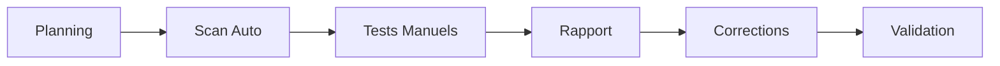

**Composants Audit :**

1. **Sécurité Technique**
   - Vulnerabilities scan
   - Penetration testing
   - Code review
   - Infrastructure audit
   - Access control review

2. **Conformité Données**
   - RGPD compliance
   - Data encryption
   - Retention policies
   - User consent
   - Right to deletion

3. **Sécurité Financière**
   - PCI DSS compliance
   - Fraud detection
   - Transaction monitoring
   - AML checks
   - KYC verification

### Gestion Accès et Permissions

```yaml
Matrice Permissions:
  Super_Admin:
    - all: "*"
    
  Finance_Admin:
    - read: ["transactions", "reports"]
    - write: ["refunds", "adjustments"]
    - delete: ["none"]
    
  Support_Admin:
    - read: ["users", "orders", "issues"]
    - write: ["tickets", "responses"]
    - delete: ["none"]
    
  Regional_Admin:
    - read: ["region_data", "local_partners"]
    - write: ["local_config", "promotions"]
    - delete: ["inactive_accounts"]
```

---

## 📈 Module Growth & Marketing

### 🎯 Parcours : Campagne Acquisition

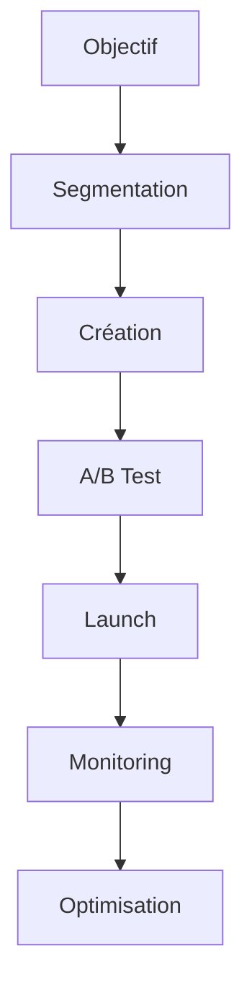

**Outils Marketing :**

1. **Segmentation Avancée**
   ```sql
   Segments Exemples:
   
   - Nouveaux Users Dormants:
     registered > 7 days
     AND orders = 0
     
   - VIP Churning:
     last_order > 30 days
     AND lifetime_value > 100k
     
   - Weekend Warriors:
     80% orders on Fri-Sun
     AND frequency > 2/month
   ```

2. **Automation Campaigns**
   - Welcome series
   - Win-back dormants
   - Loyalty progression
   - Referral program
   - Seasonal promotions

3. **Performance Tracking**
   ```
   CAMPAIGN: "Retour Rentrée 2025"
   
   Sent: 45,000 users
   Opens: 34% (15,300)
   Clicks: 12% (5,400)
   Conversions: 4.2% (1,890)
   
   Revenue: 28,350,000 FCFA
   ROI: 340%
   
   Best Segment: Parents 25-40
   Best Time: 19h-21h
   Best Channel: WhatsApp
   ```

---

## 🔌 Module Intégrations

### APIs et Webhooks

```yaml
Intégrations Actives:
  
  Paiements:
    - Orange Money API
    - MTN MoMo API
    - Moov Money API
    - Stripe (cartes)
    
  Logistics:
    - Google Maps API
    - HERE Maps (backup)
    - Weather API
    
  Communication:
    - Twilio (SMS)
    - SendGrid (Email)
    - Firebase (Push)
    - WhatsApp Business
    
  Analytics:
    - Google Analytics
    - Mixpanel
    - Amplitude
    - Custom DataLake
    
  Support:
    - Intercom
    - Zendesk
    - Slack
```

### 🎯 Parcours : Nouvelle Intégration

1. **Évaluation** (1 semaine)
   - Business case
   - Technical feasibility
   - Security review
   - Cost analysis

2. **Développement** (2-4 semaines)
   - API documentation
   - Development
   - Testing
   - Security audit

3. **Déploiement** (1 semaine)
   - Staging tests
   - Progressive rollout
   - Monitoring
   - Documentation

---

## 🎓 Module Formation Équipe

### Programme Onboarding Admin

```yaml
Semaine 1 - Fondamentaux:
  Jour 1: 
    - Présentation écosystème
    - Accès et sécurité
    - Navigation interface
    
  Jour 2-3:
    - Modules principaux
    - Cas pratiques
    - Support utilisateurs
    
  Jour 4-5:
    - Gestion urgences
    - Escalation process
    - Communication

Semaine 2 - Spécialisation:
  According to role:
    - Finance track
    - Operations track
    - Support track
    - Technical track

Semaine 3 - Mise en Pratique:
  - Shadow senior admin
  - Supervised actions
  - Feedback sessions
  - Certification
```

---

## 📊 KPIs Dashboard Admin

### Métriques Opérationnelles

| Métrique | Objectif | Alerte Si |
|----------|----------|-----------|
| Uptime Système | 99.9% | < 99.5% |
| Temps Réponse API | < 200ms | > 500ms |
| Taux Erreur | < 0.1% | > 1% |
| Queue Support | < 50 | > 100 |
| Temps Résolution | < 2h | > 4h |

### Métriques Business

| Métrique | Objectif Mensuel | YoY Growth |
|----------|------------------|------------|
| GMV | 500M FCFA | +40% |
| Utilisateurs Actifs | 100,000 | +30% |
| Nouveaux Prestataires | 500 | +25% |
| NPS Score | > 50 | +5 points |
| Churn Rate | < 5% | -2 points |

---

## 🚀 Roadmap Admin Platform

### Q1 2025
- ML-powered fraud detection
- Voice-activated commands
- Blockchain audit trail
- AR training modules

### Q2 2025
- Predictive maintenance
- Auto-scaling infrastructure
- Natural language queries
- Decentralized operations

### Q3 2025
- Full automation tier-1 support
- Self-healing systems
- Quantum-ready encryption
- Global expansion tools

---

## 🔒 Sécurité et Accès

### Politique de Sécurité

```yaml
Authentification:
  - Password: 
      min_length: 12
      complexity: high
      rotation: 90 days
  - 2FA: mandatory
  - Sessions: 8h max
  - IP_whitelist: enabled

Audit:
  - All actions logged
  - Immutable audit trail
  - Real-time alerting
  - Monthly reviews

Data:
  - Encryption at rest
  - Encryption in transit
  - PII masking
  - GDPR compliant

Access:
  - Principle of least privilege
  - Regular access reviews
  - Emergency break-glass
  - Zero-trust architecture
```

---

## 📞 Support Escalation Matrix

### Niveaux d'Escalation

| Niveau | Temps Max | Responsable | Actions |
|--------|-----------|-------------|---------|
| L0 | Immédiat | Bot/FAQ | Réponses automatiques |
| L1 | 30 min | Support Agent | Issues basiques |
| L2 | 2h | Senior Support | Issues complexes |
| L3 | 4h | Tech Team | Bugs techniques |
| L4 | 6h | Management | Issues critiques |
| Crisis | 15 min | C-Level | Incidents majeurs |

---

## 📋 Procédures Standard (SOP)

### Daily Operations Checklist

```markdown
☐ 08:00 - System health check
☐ 08:30 - Review overnight alerts
☐ 09:00 - Team standup
☐ 09:30 - Process pending validations
☐ 10:00 - Check support queue
☐ 12:00 - Midday metrics review
☐ 14:00 - Partner check-ins
☐ 16:00 - Financial reconciliation
☐ 17:00 - End of day report
☐ 18:00 - Handover to night team
```

---

*Documentation Application Admin - Version 1.0*