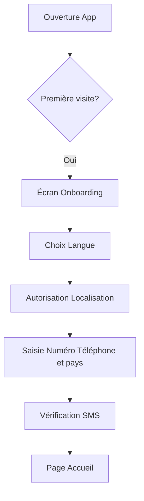
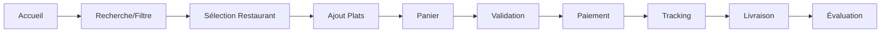
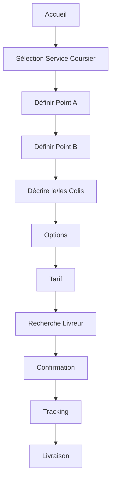
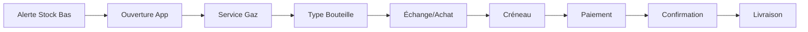
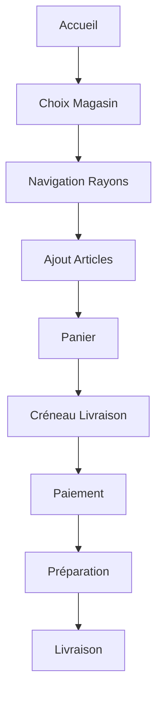
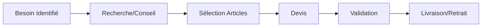

# 📱 Application Cliente - Plateforme de Services

## 🎯 Vision
Application mobile B2C simple et intuitive pour connecter les utilisateurs finaux aux prestataires de services en Afrique, avec une attention particulière à l'accessibilité et la simplicité d'utilisation.

## 🌟 Caractéristiques Principales
- **Interface ultra-simplifiée** adaptée aux novices
- **Mode offline first** pour connexions instables
- **Support multilingue** (français, anglais, langues locales)
- **Paiements flexibles** (Mobile Money, cash, portefeuille)
- **Géolocalisation intelligente** avec repères locaux

---

## 🍽️ Module 1 : Service Repas/Restaurants

### Entités et Propriétés

#### Restaurant
```yaml
Informations de base:
  - nom: String
  - logo: Image (compression adaptative)
  - bannière: Image (lazy loading)
  - description: Text (200 caractères max)
  - catégorie_cuisine: Enum [Locale, Internationale, Fast-food, Street-food, Végétarien]
  - certifications: Array [Halal, Bio, Hygiène A+]

Localisation:
  - coordonnées_GPS: {lat, lng}
  - adresse_complète: String
  - quartier: String
  - repères_locaux: Array<String>
  - zone_livraison: Polygon
  - distance_max: Number (km)

Horaires:
  - horaires_semaine: Object {lundi-dimanche: {ouverture, fermeture}}
  - pauses: Array<{début, fin}>
  - jours_fermés: Array<Date>
  - statut_temps_réel: Enum [Ouvert, Fermé, Pause, Complet]

Service:
  - temps_préparation_moyen: Number (minutes)
  - temps_livraison_estimé: Function(distance)
  - minimum_commande: Number (devise locale)
  - frais_livraison: Function(distance, heure)
  - modes_paiement: Array [MobileMoney, Cash, Carte, Portefeuille]

Engagement:
  - note_moyenne: Float (0-5)
  - nombre_avis: Integer
  - taux_acceptation: Percentage
  - temps_réponse_moyen: Number (secondes)
  - badges: Array [Rapide, Fiable, PopulaireSemaine]
```

#### Plat
```yaml
Informations:
  - nom: String
  - images: Array<Image> (carousel)
  - description: Text
  - catégorie: Enum [Entrée, Plat, Dessert, Boisson, Accompagnement]
  - tags: Array [Épicé, Végétarien, Sans gluten, Local]

Tarification:
  - prix_base: Number
  - tailles: Object {small, medium, large, family}
  - options_payantes: Array<{nom, prix}>
  - promotions: Object {type, valeur, conditions}

Personnalisation:
  - garnitures: Array<{nom, prix, disponible}>
  - niveau_piment: Scale (0-3)
  - cuisson: Enum [Saignant, À point, Bien cuit]
  - sans: Array [Oignon, Ail, Sel, Sucre]
  - suppléments: Array<{nom, prix, quantité_max}>

Disponibilité:
  - stock_actuel: Number
  - disponible: Boolean
  - temps_préparation: Number (minutes)
  - déjà_prêt: Boolean
  - service: Array [Petit-déjeuner, Déjeuner, Goûter, Dîner]
  - jours_disponibles: Array<Day>

Nutrition (optionnel):
  - calories: Number
  - protéines: Number (g)
  - glucides: Number (g)
  - lipides: Number (g)
  - allergènes: Array<String>
```

### 🎯 Parcours Utilisateur : Commander un Repas

#### Parcours 1 : Première Commande (Nouvel Utilisateur)



**Étapes Détaillées :**

1. **Onboarding (3 écrans max)**
   - Écran 1 : "Bienvenue ! Commandez vos plats préférés"
   - Écran 2 : "Livraison rapide dans votre quartier"
   - Écran 3 : "Payez comme vous voulez"
   - [Skip possible à tout moment]

2. **Configuration Initiale**
   - Sélection langue (avec drapeaux visuels)
   - Demande GPS : "Pour trouver les restaurants près de vous"
   - Si refus GPS → Saisie manuelle quartier/zone
   - Numéro de téléphone → Code SMS à 4 chiffres

3. **Page d'Accueil**
   - Bannière promo du jour
   - Catégories en icônes (Repas et icons des autres catégorie)
   - "Près de vous" avec restaurants < 5km(modifiable): cette option concerne uniquement certaines catégorie
   - Barre de recherche avec suggestion vocale

#### Parcours 2 : Commande Rapide (Utilisateur Habitué)



**Étapes Détaillées :**

1. **Recherche et Découverte** (30 sec)
   - Barre de recherche : tape ou dicte "Pizza"
   - Filtres rapides : Prix (€/€€/€€€), Distance, Note, Temps
   - Tri : Pertinence, Plus proche, Plus rapide, Mieux noté
   - Résultats avec badges visuels (🔥 Populaire, ⚡ Rapide, 💰 Promo)

2. **Page Restaurant** (45 sec)
   - Header : Photo, nom, note, temps estimé, frais livraison
   - 3 onglets : Menu | Avis | Infos
   - Menu groupé par catégories avec prix visibles
   - Bouton flottant : "Voir panier (3)" si articles ajoutés

3. **Sélection Plat** (20 sec)
   - Photo grande qualité
   - Prix dynamique selon options
   - Personnalisation simple :
     * Taille : [S] [M] [L] [XL]
     * Piment : 🌶️ [0][1][2][3]
     * Garnitures : Cases à cocher avec prix
   - Quantité : [-] 1 [+]
   - Bouton : "Ajouter 15.000 FCFA"

4. **Panier** (30 sec)
   - Liste des articles avec prix
   - Modification quantité en ligne
   - Code promo (optionnel)
   - Sous-total + Frais livraison = Total
   - Note pour le restaurant (optionnel)
   - Bouton : "Commander"

5. **Validation Commande** (20 sec)
   - Adresse livraison (GPS ou saisie)
   - Ajout repères : "Maison bleue près de l'école"
   - Heure souhaitée : Maintenant / Programmer
   - Récapitulatif avec temps estimé

6. **Paiement** (30 sec)
   - Options visuelles :
     * 💵 Cash à la livraison
     * 📱 Orange/MTN/Moov Money (API)
     * 💳 Carte bancaire(API)
     * 👛 Mon portefeuille (solde affiché)
   - Confirmation : "Paiement en cours..."

7. **Tracking Temps Réel** (durée livraison)
   - Timeline visuelle :
     * ✅ Commande confirmée
     * 👨‍🍳 En préparation (15 min)
     * 🚴 En route (20 min)
     * 📍 Arrivé
   - Carte avec position livreur
   - Chat/Appel avec restaurant et livreur
   - Notifications push à chaque étape

8. **Réception** (1 min)
   - Code de confirmation à 2 Lettre uniquement en majuscule(exemple: "A9")
   - Photo de la livraison (optionnel)
   - Confirmation de réception

9. **Évaluation** (30 sec)
   - Note rapide : ⭐⭐⭐⭐⭐
   - Tags prédéfinis : "Délicieux", "Rapide", "Chaud", "Bien emballé"
   - Commentaire (optionnel)
   - Pourboire livreur (optionnel)

---

## 🚴 Module 2 : Service Livraison/Coursier

### Entités et Propriétés

#### Livreur
```yaml
Profil:
  - nom_complet: String
  - photo: Image (vérifiée)
  - pièce_identité: Document (crypté, non visible)
  - document_valide: Boolean
  - téléphone: String (vérifié)
  - email: String (optionnel)

Véhicule:
  - type: Enum [Piéton, Vélo, Moto, Tricycle, Voiture, Camion]
  - marque_modèle: String
  - couleur: String
  - immatriculation: String
  - photos: Array<Image> (4 angles)
  - assurance: Boolean + Document
  - capacité_charge: Number (kg)

Performance:
  - note_moyenne: Float (0-5)
  - nombre_livraisons: Integer
  - taux_réussite: Percentage
  - ponctualité: Percentage
  - badges: Array [Rapide, Soigneux, Professionnel]

Préférences:
  - zones_service: Array<Zone>
  - types_colis_acceptés: Array<Type>
  - horaires_disponibilité: Schedule
  - distance_max: Number (km)
```

#### Colis
```yaml
Trajets:
  - point_départ: {GPS, adresse, repère, contact}
  - point_arrivée: {GPS, adresse, repère, contact}
  - points_intermédiaires: Array<Point> (max 3)
  - distance_totale: Number (km)
  - durée_estimée: Number (minutes)

Caractéristiques:
  - type: Enum [Colis, Documents, Nourriture, Médicaments, Courses, Fragile]
  - poids_estimé: Enum [<5kg, 5-15kg, 15-30kg, >30kg]
  - dimensions: Enum [Enveloppe, Petit, Moyen, Grand, Très grand]
  - valeur_déclarée: Number (pour assurance)
  - photos: Array<Image>
  - telephone_destinataire: Text

Options:
  - urgence: Enum [Normal, Express]
  - assurance: Boolean
  - confirmation_réception: Enum [Aucune, SMS, Photo, Signature]
  - instructions_spéciales: Text
  - retour_si_absent: Boolean
  - véhicule_recommande: Text
```

### 🎯 Parcours Utilisateur : Envoyer un Colis

#### Parcours Principal : Livraison Standard



**Étapes Détaillées :**

1. **Initiation** (10 sec)
   - Depuis accueil : Icône 🚴 "Coursier"
   - Ou recherche : "Envoyer colis"
   - Page avec 2 boutons principaux :
     * "Envoyer maintenant"
     * "Programmer pour plus tard"

2. **Point de Départ (Point A)** (30 sec)
   - Par défaut : "📍 Ma position actuelle"
   - Options :
     * Carte interactive avec pin
     * Recherche adresse (autocomplétion)
     * Favoris : Maison, Bureau, etc.
   - Champs additionnels :
     * Nom contact expéditeur
     * Téléphone
     * Repère visuel ("Portail vert")
     * Instructions ("Sonner 2 fois")

3. **Point d'Arrivée (Point B)** (30 sec)
   - Même interface que Point A
   - Affichage distance calculée
   - Option : "+ Ajouter un arrêt" (max 3)
   - Validation automatique de la zone de service

4. **Description du Colis** (20 sec)
   - Sélection visuelle par icônes :
     * 📦 Colis standard
     * 📄 Documents
     * 🍕 Nourriture (options température)
     * 💊 Médicaments (urgence possible)
     * 💐 Fleurs (fragile)
     * 🛍️ Courses
   - Poids : Slider visuel avec références
     * < 5kg : "Comme un sac à main"
     * 5-15kg : "Comme un carton de déménagement"
     * 15-30kg : "Comme une valise pleine"
     * > 30kg : "Nécessite aide au portage"
   - Taille : Images comparatives
   - Photo optionnelle du colis

5. **Options de Livraison** (15 sec)
   - Urgence :
     * Standard (2-3h) - Prix normal
     * Express (1h) - Prix +50%
     * Ultra-express (30min) - Prix +100%
   - Sécurité :
     * ☐ Assurance (2% valeur déclarée)
     * ☐ Photo avant/après
     * ☐ Code de confirmation
     * ☐ Signature à la réception

6. **Calcul et Affichage Tarif** (10 sec)
   - Animation de calcul
   - Détail transparent :
     * Base distance : X FCFA
     * Poids : +X FCFA
     * Urgence : +X FCFA
     * Assurance : +X FCFA
     * **Total : X FCFA**
   - Comparaison si plusieurs livreurs disponibles

7. **Matching avec Livreur** (30 sec)
   - Animation recherche : "Recherche du meilleur coursier..."
   - Critères automatiques :
     * Proximité du point A
     * Capacité véhicule vs poids
     * Disponibilité immédiate
     * Note minimale 4/5
   - Affichage livreur trouvé :
     * Photo, nom, note
     * Type véhicule
     * Temps d'arrivée estimé
   - Options : "Accepter" ou "Chercher un autre"

8. **Tracking en Temps Réel** (durée trajet)
   - Vue carte avec trajets
   - Position live du livreur
   - Timeline :
     * ⏱️ Livreur en route vers point A (15 min)
     * 📦 Colis récupéré
     * 🚴 En route vers destination (25 min)
     * ✅ Livré
   - Chat/Appel disponible
   - Partage du tracking par SMS/WhatsApp

9. **Confirmation Livraison** (30 sec)
   - Notification : "Colis livré !"
   - Si code : Vérification auprès destinataire
   - Si photo : Affichage preuve de livraison
   - Évaluation rapide du livreur

---

## ⛽ Module 3 : Service Recharge Gaz

### Entités et Propriétés

#### Fournisseur Gaz
```yaml
Entreprise:
  - nom_société: String
  - licence_commerce: String
  - certifications_sécurité: Array<Document>
  - assurance_responsabilité: Document

Stock:
  - bouteilles_disponibles: Object
    * 6kg: {stock, prix, marque}
    * 12.5kg: {stock, prix, marque}
    * 25kg: {stock, prix, marque}
    * 50kg: {stock, prix, marque}
  - marques: Array [Total, Shell, Oryx, Local]

Service:
  - zone_couverture: Array<Zone>
  - horaires_livraison: Schedule
  - délai_moyen: Number (heures)
  - service_urgence: Boolean
  - installation_offerte: Boolean
```

### 🎯 Parcours Utilisateur : Commander du Gaz

#### Parcours : Recharge Gaz Express



**Étapes Détaillées :**

1. **Déclenchement** (notification push)
   - Alerte automatique : "Votre dernière recharge remonte à 30 jours"
   - Ou accès manuel via icône ⛽ "Gaz"

2. **Sélection Type** (15 sec)
   - Visuel des tailles avec prix :
     * 6kg - Usage camping (X FCFA)
     * 12.5kg - Ménage standard (X FCFA)
     * 25kg - Grande famille (X FCFA)
     * 50kg - Commercial (X FCFA)
   - Historique : "Vous prenez habituellement 12.5kg"

3. **Type de Service** (10 sec)
   - 🔄 Échange bouteille vide (moins cher)
   - 🆕 Nouvelle bouteille (consigne incluse)
   - Option : "Vérification sécurité gratuite"

4. **Planification** (20 sec)
   - Créneaux disponibles :
     * Maintenant (supplément express)
     * Aujourd'hui : [14h-16h] [16h-18h] [18h-20h]
     * Demain : Créneaux de 2h
   - Adresse : Reprise automatique ou modification
   - Instructions : "Laisser au gardien si absent"

5. **Confirmation et Paiement** (20 sec)
   - Récapitulatif avec prix total
   - Rappel sécurité : "Assurez-vous d'avoir fermé l'ancien robinet"
   - Paiement : Mobile Money ou Cash
   - SMS de confirmation avec détails

6. **Jour de Livraison** (5 min)
   - Notification : "Livreur en route"
   - Appel du livreur à l'arrivée
   - Vérification :
     * État de la nouvelle bouteille
     * Date de validité
     * Test de fuite rapide
   - Échange et installation si demandé
   - Signature numérique

---

## 🛒 Module 4 : Service Boutique/Supermarché

### 🎯 Parcours Utilisateur : Courses en Ligne

#### Parcours : Liste de Courses Familiale



**Étapes Détaillées :**

1. **Sélection Magasin** (20 sec)
   - Géolocalisation : Magasins proches
   - Filtres : Supermarché, Épicerie, Spécialisé
   - Infos : Distance, frais, minimum commande
   - Favoris en premier

2. **Navigation Produits** (5 min)
   - Rayons visuels :
     * 🥖 Boulangerie
     * 🥩 Boucherie
     * 🥛 Produits laitiers
     * 🥦 Fruits & Légumes
   - Barre de recherche intelligente
   - Filtres : Prix, Marque, Promo
   - "Mes habitudes" : Produits fréquents

3. **Ajout au Panier** (continu)
   - Photo produit + prix au kg/unité
   - Quantité : [−] 1 [+] ou saisie directe
   - Alternatives proposées si rupture
   - Total panier visible en permanence

4. **Gestion Panier** (2 min)
   - Révision des articles
   - "Sauvegarder liste" pour prochaine fois
   - Application des promotions
   - Vérification minimum commande

5. **Livraison** (1 min)
   - Créneaux de 2h disponibles
   - Option "Réception par gardien"
   - Sacs réutilisables (optionnel)

6. **Suivi Commande** (30 min - 2h)
   - Statut : Préparation → En route → Arrivé
   - Chat avec personal shopper
   - Validation substitutions
   - Ajout dernière minute possible

---

## 🔧 Module 5 : Service Quincaillerie

### 🎯 Parcours Utilisateur : Achat Matériel

#### Parcours : Projet Bricolage



**Étapes Détaillées :**

1. **Identification Besoin** (1 min)
   - Catégories visuelles :
     * 🔨 Outils
     * 🚰 Plomberie
     * ⚡ Électricité
     * 🎨 Peinture
     * 🪜 Location matériel
   - "Besoin d'aide ?" → Chat/Vidéo avec expert

2. **Recherche Assistée** (3 min)
   - Description du projet
   - Suggestions de matériel nécessaire
   - Tutoriels vidéo intégrés
   - Calculateurs (peinture/m², câbles, etc.)

3. **Constitution Panier** (5 min)
   - Vérification compatibilité articles
   - Options location vs achat
   - Quantités suggérées selon projet
   - Prix dégressifs pour volume

4. **Devis Détaillé** (2 min)
   - PDF téléchargeable
   - Validité 7 jours
   - Option "Demander conseil pro"
   - Partage WhatsApp possible

5. **Finalisation** (2 min)
   - Livraison (délai selon poids)
   - Retrait magasin (prêt en 2h)
   - Option : Mise en relation artisan

---

## 🔐 Fonctionnalités Transverses

### Système d'Authentification
```yaml
Inscription:
  - Numéro téléphone → SMS OTP
  - Email (optionnel)
  - Nom complet
  - Photo profil (optionnel)

Connexion:
  - Téléphone + OTP
  - Biométrie (empreinte/face)
  - Code PIN (4 chiffres)
  - Session persistante 30 jours
```

### Gestion des Paiements
```yaml
Mobile Money:
  - Intégration API directe
  - USSD fallback
  - Confirmation instantanée
  - Historique transactions

Cash:
  - Calcul monnaie à rendre
  - Confirmation livreur requise
  - Option "Pas de monnaie"

Portefeuille Interne:
  - Rechargement points de vente
  - Bonus fidélité
  - Cashback automatique
  - Transfert entre utilisateurs
```

### Support Client Intégré
```yaml
Canaux:
  - Chat in-app (bot + humain)
  - Appel direct (bouton SOS)
  - FAQ interactive
  - Tutoriels vidéo

Résolution:
  - Tickets automatiques
  - Escalade si non résolu 24h
  - Compensation automatique retards
  - Système de médiation
```

### Programme de Fidélité
```yaml
Points:
  - 1 point = 100 FCFA dépensés
  - Bonus parrainage
  - Défis hebdomadaires
  - Niveaux : Bronze → Argent → Or

Récompenses:
  - Réductions progressives
  - Livraison gratuite
  - Accès prioritaire promos
  - Cadeaux anniversaire
```

---

## 📊 Métriques de Succès Utilisateur

### KPIs Principaux
- **Taux d'activation** : Première commande sous 7 jours
- **Rétention** : Utilisateurs actifs J30/J60/J90
- **Fréquence** : Commandes par mois
- **Panier moyen** : Valeur moyenne transaction
- **NPS** : Recommandation (>50 excellent)
- **Temps de résolution** : Support < 2h
- **Taux de complétion** : Commandes finalisées/initiées

### Objectifs par Service
| Service | Activation J7 | Rétention J30 | Fréq/mois | Panier Moyen |
|---------|--------------|---------------|-----------|--------------|
| Restaurants | 60% | 40% | 4 | 15,000 FCFA |
| Livraison | 40% | 30% | 2 | 10,000 FCFA |
| Gaz | 30% | 70% | 1 | 25,000 FCFA |
| Boutique | 50% | 45% | 3 | 30,000 FCFA |
| Quincaillerie | 20% | 25% | 0.5 | 50,000 FCFA |

---

## 🚀 Évolutions Futures

### Phase 1 (3 mois)
- Commande vocale en langues locales
- Paiement par QR code
- Mode famille (comptes liés)

### Phase 2 (6 mois)
- Abonnements mensuels
- Recommandations IA
- Gamification avancée

### Phase 3 (12 mois)
- Social shopping (commandes groupées)
- Marketplace C2C
- Crédit intégré

---

*Documentation Application Cliente - Version 1.0*
