# 💼 Application Prestataire - Plateforme Business

## 🎯 Vision
Application B2B permettant aux prestataires de services (restaurants, livreurs, commerçants) de gérer efficacement leur activité, avec des outils simples adaptés au contexte africain et une formation intégrée.

## 🌟 Caractéristiques Principales
- **Dashboard unifié** pour tous les services
- **Gestion temps réel** des commandes et stocks
- **Formation intégrée** avec tutoriels locaux
- **Mode hors ligne** pour les coupures réseau
- **Analytics simplifiés** pour non-techniciens

---

## 👤 Module Onboarding Prestataire

### 🎯 Parcours : Inscription et Vérification

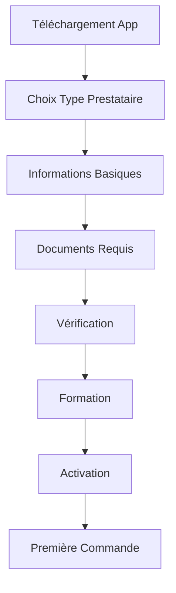

**Étapes Détaillées :**

1. **Sélection Type de Service** (30 sec)
   - Écran avec icônes :
     * 🍽️ Restaurant/Traiteur
     * 🚴 Livreur/Coursier
     * 🛒 Boutique/Épicerie
     * ⛽ Fournisseur Gaz
     * 🔧 Quincaillerie
   - Multi-sélection possible

2. **Informations de Base** (3 min)
   - **Personne Physique :**
     * Nom complet
     * Photo selfie (guide visuel)
     * Numéro téléphone → Vérification SMS
     * Email (optionnel)
     * Adresse complète + GPS
   
   - **Entreprise :**
     * Nom commercial
     * Numéro registre commerce
     * Secteur d'activité
     * Nombre d'employés
     * Chiffre d'affaires estimé

3. **Upload Documents** (5 min)
   - Guide photo pour chaque document
   - **Restaurant :**
     * Licence commerce ✓
     * Certificat hygiène ✓
     * Photos local (intérieur/extérieur)
     * Menu actuel
   
   - **Livreur :**
     * Pièce identité ✓
     * Permis conduire (si motorisé)
     * Assurance véhicule
     * Photos véhicule (4 angles)
   
   - **Commerce :**
     * Patente ✓
     * Certificat fiscal
     * Photos magasin

4. **Processus de Vérification** (24-48h)
   - Statut temps réel :
     * ⏳ En attente
     * 🔍 En cours de vérification
     * ✅ Approuvé
     * ❌ Refusé (avec raisons)
   - Notifications push à chaque étape
   - Chat support si problème

5. **Formation Obligatoire** (30 min)
   - **Vidéos courtes (3-5 min) :**
     * Comment recevoir une commande
     * Gestion des stocks
     * Communication client
     * Standards de qualité
     * Utilisation du dashboard
   
   - **Quiz de validation :**
     * 10 questions simples
     * 80% requis pour passer
     * Tentatives illimitées
     * Certificat de formation

6. **Configuration Initiale** (15 min)
   - **Restaurant :**
     * Import/création menu
     * Horaires d'ouverture
     * Zones de livraison
     * Temps préparation par défaut
   
   - **Livreur :**
     * Zones de travail préférées
     * Horaires disponibilité
     * Types de courses acceptées
   
   - **Commerce :**
     * Catégories produits
     * Inventaire initial
     * Modes de paiement

7. **Activation et Test** (10 min)
   - Commande test interne
   - Vérification processus complet
   - Badge "Nouveau Partenaire" 30 jours
   - Support prioritaire première semaine

---

## 🍽️ Module Restaurant

### Interface Principale

```yaml
Dashboard Restaurant:
  header:
    - statut: [Ouvert/Fermé/Pause]
    - toggle_rapide: Switch On/Off
    - commandes_en_attente: Number + Notification
    - note_du_jour: Float/5
    
  widgets:
    - revenus_jour: 
        * total: Amount
        * nombre_commandes: Integer
        * ticket_moyen: Amount
        * graphique_horaire: Chart
    
    - commandes_actives:
        * nouvelles: List + Son alerte
        * en_préparation: List + Timer
        * prêtes: List
        * en_livraison: List + Map
    
    - performances:
        * temps_moyen: Minutes
        * taux_acceptation: Percentage
        * satisfaction: Stars
        * top_plats: List
```

### 🎯 Parcours : Gestion d'une Commande

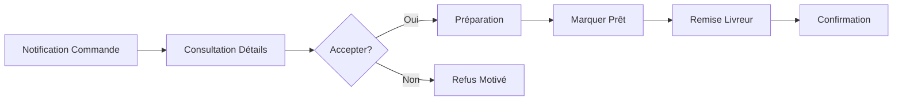

**Étapes Détaillées :**

1. **Réception Commande** (10 sec)
   - **Alerte Multicanal :**
     * Son fort personnalisable
     * Vibration continue
     * Notification écran verrouillé
     * LED clignotante (si disponible)
   
   - **Preview Rapide :**
     * Montant total en gros
     * Nombre d'articles
     * Type (Sur place/Emporter/Livraison)
     * Urgence (Normal/Express)

2. **Consultation Détails** (20 sec)
   - **Écran Commande :**
     ```
     🆕 NOUVELLE COMMANDE #2847
     Client: Jean Kouassi ⭐4.5
     
     Articles (3):
     • 2x Poulet Braisé - 10,000 F
       → Sans piment
       → Avec attiéké extra
     • 1x Poisson Fumé - 7,000 F
     • 2x Bissap - 2,000 F
     
     Total: 19,000 FCFA
     Livraison: Dans 45 min
     Adresse: Cocody, près pharmacie
     Note: "Svp bien cuit"
     
     [ACCEPTER] [REFUSER]
     ```

3. **Décision Acceptation** (5 sec)
   - **Si Accepter :**
     * Confirmation vibration
     * Ajout à la file active
     * Notification client automatique
     * Démarrage timer préparation
   
   - **Si Refuser :**
     * Motifs prédéfinis :
       - "Trop de commandes"
       - "Article non disponible"
       - "Fermeture imminente"
       - "Problème technique"
     * Suggestion alternative au client

4. **Phase Préparation** (temps variable)
   - **Timer Visuel :**
     * Compte à rebours grand format
     * Code couleur (Vert→Orange→Rouge)
     * Alerte à 5 min de la fin
   
   - **Actions Possibles :**
     * ⏸️ Pause (max 10 min)
     * ➕ Ajouter temps (+5/10/15 min)
     * 💬 Message au client
     * 📞 Appeler client
   
   - **Gestion Rupture :**
     * Signaler article manquant
     * Proposer alternative
     * Ajuster prix automatiquement

5. **Marquage Prêt** (5 sec)
   - Swipe ou bouton "✓ Prêt"
   - Photo du plat emballé (optionnel)
   - Notification automatique livreur
   - Déplacement vers section "À récupérer"

6. **Remise au Livreur** (30 sec)
   - **Vérification Livreur :**
     * Photo + Nom affiché
     * Code de récupération
     * Scan QR code (optionnel)
   
   - **Check-list Remise :**
     * ☐ Commande complète
     * ☐ Bien emballé
     * ☐ Couverts/serviettes
     * ☐ Reçu inclus
   
   - Signature numérique livreur

### 🎯 Parcours : Gestion du Menu

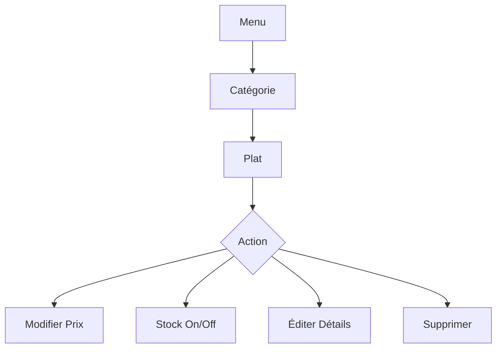

**Étapes Détaillées :**

1. **Navigation Menu** (10 sec)
   - Vue par catégories (accordéon)
   - Recherche rapide
   - Filtres : Disponible/Rupture/Populaire

2. **Actions Rapides** (5 sec/action)
   - **Toggle Disponibilité :**
     * Switch On/Off instantané
     * Badge "Rupture" visible clients
   
   - **Ajustement Prix :**
     * Tap sur prix → Clavier numérique
     * Historique modifications
     * Application immédiate
   
   - **Promotion Flash :**
     * Sélection multiple plats
     * -10% / -20% / -30% / Personnalisé
     * Durée : 1h / 2h / 4h / Journée

3. **Modification Complète** (2 min)
   - Upload nouvelle photo
   - Édition description
   - Gestion options/suppléments
   - Tags et catégories
   - Informations nutritionnelles

### 🎯 Parcours : Analytics et Rapports

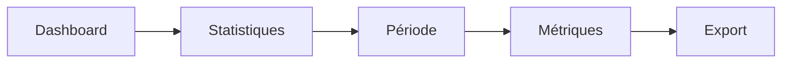

**Étapes Détaillées :**

1. **Accès Statistiques** (5 sec)
   - Icône 📊 depuis dashboard
   - Ou swipe latéral

2. **Sélection Période** (10 sec)
   - Presets : Aujourd'hui/Semaine/Mois
   - Calendrier pour personnalisé
   - Comparaison période précédente

3. **Visualisation Métriques** (1 min)
   - **Graphiques Simples :**
     * Revenus (courbe)
     * Commandes (barres)
     * Top plats (camembert)
     * Heures de pointe (heatmap)
   
   - **Indicateurs Clés :**
     * Croissance vs période précédente
     * Panier moyen évolution
     * Taux de refus
     * Note moyenne

4. **Export et Partage** (20 sec)
   - Format : PDF / Excel / CSV
   - Envoi : Email / WhatsApp
   - Intégration comptabilité

---

## 🚴 Module Livreur/Coursier

### Interface Principale

```yaml
Dashboard Livreur:
  header:
    - statut: [En ligne/Hors ligne/Pause]
    - earnings_today: Amount
    - trips_count: Integer
    - current_balance: Amount
    
  map_view:
    - my_position: GPS Marker
    - available_orders: Heat zones
    - active_delivery: Route
    - traffic: Real-time
    
  bottom_sheet:
    - nouvelles_courses: List + Distance
    - earnings_breakdown: Details
    - zone_stats: Demande niveau
```

### 🎯 Parcours : Acceptation et Livraison

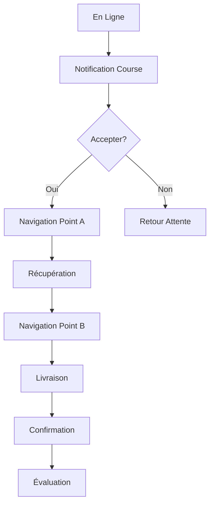

**Étapes Détaillées :**

1. **Mise en Ligne** (10 sec)
   - **Grand bouton central :**
     * "GO EN LIGNE" animation
     * Vérifications automatiques :
       - GPS activé ✓
       - Internet OK ✓
       - Documents valides ✓
   
   - **Sélection Mode :**
     * 🏍️ Moto (rapide, tous types)
     * 🚴 Vélo (écolo, courtes distances)
     * 🚶 À pied (centre-ville uniquement)
     * 🚗 Voiture (gros colis)

2. **Réception Demande** (15 sec)
   - **Notification Plein Écran :**
     ```
     NOUVELLE COURSE! 
     📍 2.3 km de vous
     
     Type: 🍕 Nourriture
     Distance totale: 5.8 km
     Gain estimé: 2,500 FCFA
     Temps estimé: 25 min
     
     Pickup: Restaurant Le Délice
          → Plateau, Rue 12
     Dropoff: Cocody, Résidence Palmier
     
     ⏱️ 30 sec pour accepter
     [✓ ACCEPTER] [✗ REFUSER]
     ```
   
   - **Détails Additionnels (swipe up):**
     * Note du restaurant
     * Historique avec ce client
     * Trafic sur le trajet
     * Météo actuelle

3. **Navigation vers Pickup** (temps variable)
   - **GPS Intégré :**
     * Waze/Google Maps integration
     * Mode moto (passages étroits)
     * Évitement embouteillages
     * Commande vocale
   
   - **Communication :**
     * Chat restaurant
     * Appel masqué
     * Templates messages :
       - "J'arrive dans 5 min"
       - "Je suis arrivé"
       - "Embouteillage, retard 10 min"

4. **Récupération Commande** (2 min)
   - **Arrivée Restaurant :**
     * Bouton "Je suis arrivé"
     * Notification au restaurant
     * Timer attente (si applicable)
   
   - **Processus Pickup :**
     * Présentation code/nom
     * Vérification commande :
       ```
       Commande #2847
       ☐ 2x Poulet Braisé
       ☐ 1x Poisson Fumé  
       ☐ 2x Bissap
       ☐ Couverts inclus
       
       [CONFIRMER RÉCUPÉRATION]
       ```
     * Photo preuve (optionnel)
     * Départ vers client

5. **Navigation vers Client** (temps variable)
   - **Optimisation Route :**
     * Recalcul temps réel
     * Alertes zones dangereuses
     * Parking suggestions
   
   - **Updates Client :**
     * Position live sharing
     * ETA automatique
     * "J'arrive dans X min"

6. **Livraison au Client** (2 min)
   - **Arrivée Destination :**
     * Bouton "Arrivé chez client"
     * Appel automatique client
     * Instructions spéciales affichées
   
   - **Processus Remise :**
     * Code confirmation 4 chiffres
     * Ou scan QR code
     * Collecte cash si applicable
     * Photo livraison (si demandé)
   
   - **Confirmation :**
     ```
     ✅ LIVRAISON COMPLÈTE
     
     Durée: 23 minutes
     Distance: 5.8 km
     
     Gains:
     Base: 1,500 F
     Distance: 700 F
     Bonus rapidité: 300 F
     Total: 2,500 FCFA
     
     [CONTINUER]
     ```

### 🎯 Parcours : Gestion des Gains

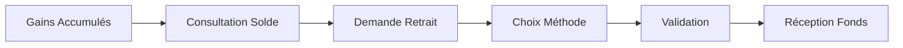

**Étapes Détaillées :**

1. **Vue Détaillée Gains** (30 sec)
   - **Dashboard Financier :**
     * Aujourd'hui : Montant + Courses
     * Cette semaine : Graph progression
     * Ce mois : Total + Objectif
     * Historique : Liste détaillée

2. **Demande de Retrait** (1 min)
   - **Solde Disponible :**
     * Montant retirable
     * En cours de traitement
     * Minimum retrait : 5,000 FCFA
   
   - **Options Retrait :**
     * Mobile Money (instantané)
     * Virement bancaire (24h)
     * Cash point relais (2h)
     * Carte prépayée (immédiat)

3. **Processus Validation** (30 sec)
   - Montant à retirer
   - Confirmation identité (PIN/Biométrie)
   - Frais affichés (1-2%)
   - Reçu numérique

---

## 🛒 Module Commerce (Boutique/Supermarché/Quincaillerie)

### Interface Principale

```yaml
Dashboard Commerce:
  header:
    - status_magasin: [Ouvert/Fermé]
    - commandes_pending: Number
    - ruptures_stock: Alert Count
    
  sections:
    - ventes_flash:
        * revenue_jour: Amount
        * transactions: Count
        * top_produits: List
    
    - inventory_alerts:
        * ruptures: Products List
        * stock_faible: Products < 10
        * périmés_soon: Date Alert
    
    - commandes_online:
        * nouvelles: List
        * en_preparation: Progress
        * ready_pickup: Count
```

### 🎯 Parcours : Gestion Inventaire

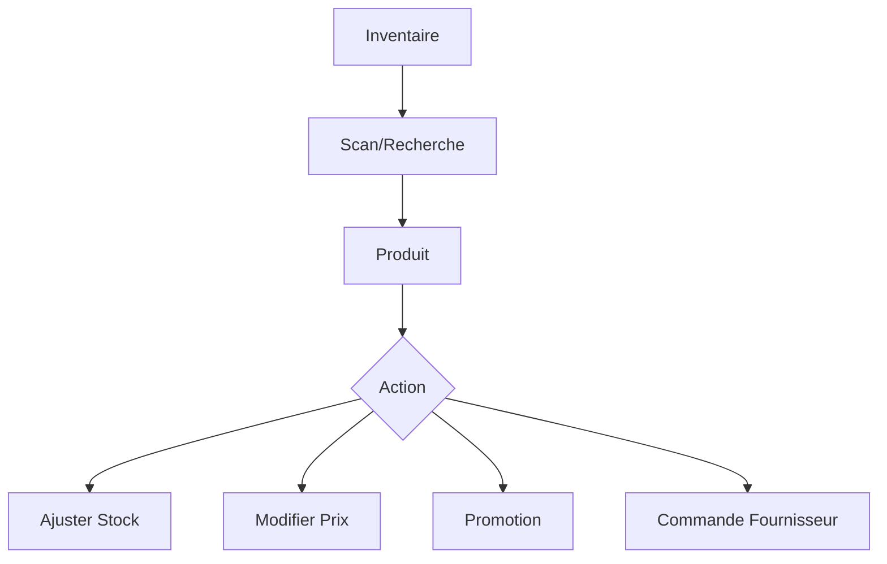

**Étapes Détaillées :**

1. **Accès Inventaire** (5 sec)
   - Icône 📦 depuis dashboard
   - Vue : Liste/Grille/Catégories

2. **Recherche Produit** (10 sec)
   - **Options Recherche :**
     * Scanner code-barres
     * Recherche nom/référence
     * Navigation catégories
     * Filtres (stock faible/rupture)

3. **Fiche Produit** (interface)
   ```
   📷 [Photo Produit]
   
   Savon Marseille 200g
   Code: 628374927
   
   Stock: 47 unités ⚠️
   Prix: 1,500 FCFA
   Dernier réappro: Il y a 5 jours
   Ventes/semaine: 23
   
   Actions:
   [📊 Stats] [✏️ Éditer] [🏷️ Promo] [📦 Commander]
   ```

4. **Ajustement Stock** (30 sec)
   - **Motifs Ajustement :**
     * Réception livraison (+)
     * Vente physique (-)
     * Perte/Casse (-)
     * Inventaire physique (±)
   
   - Quantité : Clavier ou scan multiple
   - Commentaire optionnel
   - Historique modifications

5. **Gestion Prix et Promos** (1 min)
   - **Modification Prix :**
     * Nouveau prix
     * Date application
     * Étiquette auto-update
   
   - **Création Promotion :**
     * Type : -%, 2+1, Bundle
     * Durée : Heures/Jours
     * Quantité limitée
     * Badge auto sur app client

### 🎯 Parcours : Préparation Commande Online

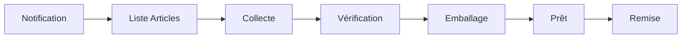

**Étapes Détaillées :**

1. **Réception Commande** (10 sec)
   - Alert sonore + notification
   - Badge sur icône commandes
   - Liste nouvelles commandes

2. **Vue Commande** (30 sec)
   ```
   COMMANDE #8473
   Client: Marie Kouadio
   
   Articles (7):
   ☐ 2x Lait Bonnet Rouge 1L
   ☐ 1x Pain Complet
   ☐ 500g Tomates fraîches
   ☐ 3x Eau Awa 1.5L
   ☐ 1x Huile Dinor 1L
   ☐ 2x Papier Toilette
   ☐ 1x Dentifrice Signal
   
   Mode: Livraison 16h-18h
   Total: 12,750 FCFA
   Payé: Mobile Money ✓
   
   [COMMENCER PRÉPARATION]
   ```

3. **Collecte Articles** (5 min)
   - Check items un par un
   - Si rupture : 
     * Proposer substitut
     * Chat client
     * Ajustement prix auto
   - Timer préparation visible

4. **Finalisation** (2 min)
   - Photo sacs préparés
   - Génération code pickup
   - Notification client/livreur
   - Déplacement zone "Prêt"

---

## ⛽ Module Fournisseur Gaz

### Interface Spécifique

```yaml
Dashboard Gaz:
  safety_check:
    - certificats_valid: Status + Days
    - formations_equipe: Percentage
    - incidents_mois: Count
    
  stock_bouteilles:
    - par_taille:
        6kg: {plein, vide, défaut}
        12.5kg: {plein, vide, défaut}
        25kg: {plein, vide, défaut}
    
  planning_livraisons:
    - aujourd_hui: Timeline + Map
    - demain: Count + Créneaux
    - urgences: Priority Queue
```

### 🎯 Parcours : Livraison Sécurisée Gaz

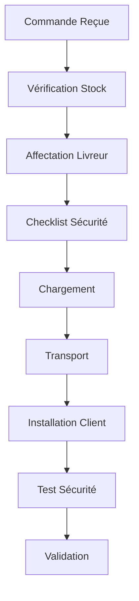

**Étapes Détaillées :**

1. **Réception et Validation** (1 min)
   - Vérification disponibilité taille
   - Check zone de livraison
   - Confirmation créneau
   - Attribution livreur qualifié

2. **Préparation Sécurisée** (5 min)
   - **Checklist Obligatoire :**
     * ✓ État bouteille (pas de rouille)
     * ✓ Date validité OK
     * ✓ Joint neuf inclus
     * ✓ Détendeur vérifié
     * ✓ Équipement sécurité livreur
   
   - Scan code bouteille
   - Photo avant départ

3. **Process Installation** (10 min)
   - **Chez le Client :**
     * Test ancien équipement
     * Échange bouteille
     * Installation détendeur
     * Test fuite (eau savonneuse)
     * Formation usage si nouveau client
   
   - **Documentation :**
     * Photo installation
     * Signature numérique
     * Certificat de conformité
     * Rappel sécurité SMS

---

## 🎓 Module Formation Continue

### 🎯 Parcours : Montée en Compétences

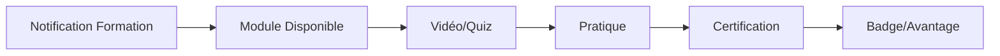

**Contenu Formations :**

1. **Basiques (Obligatoires)**
   - Utilisation application (30 min)
   - Standards qualité service (20 min)
   - Communication client (15 min)
   - Gestion conflits (20 min)

2. **Avancées (Optionnelles)**
   - Marketing digital local (45 min)
   - Photographie produits (30 min)
   - Gestion financière (1h)
   - Fidélisation client (30 min)

3. **Spécialisées par Métier**
   - **Restaurant :**
     * Hygiène HACCP
     * Optimisation cuisine
     * Menu engineering
   
   - **Livreur :**
     * Conduite défensive
     * Premiers secours
     * Optimisation routes
   
   - **Commerce :**
     * Merchandising
     * Gestion stocks
     * Négociation fournisseurs

**Système de Récompenses :**
- Badge par formation complétée
- Bonus visibilité dans l'app
- Réduction commissions
- Accès fonctionnalités premium

---

## 💰 Module Financier

### 🎯 Parcours : Gestion Financière

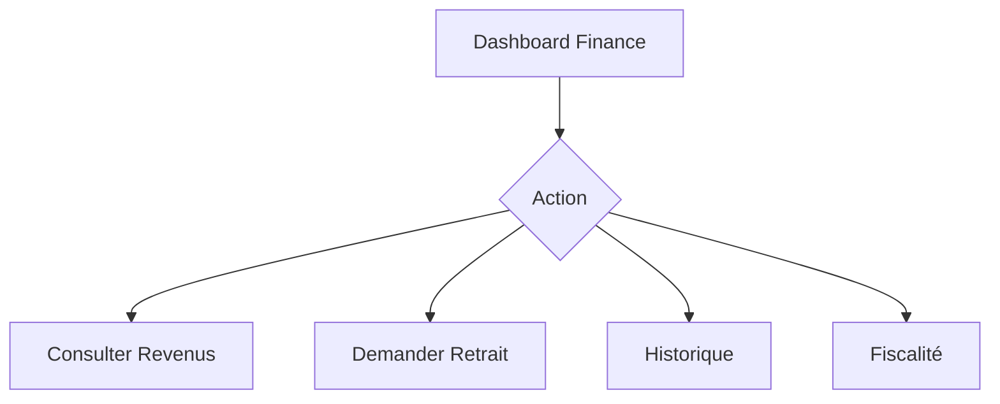

**Fonctionnalités :**

1. **Tableau de Bord** (temps réel)
   ```
   FINANCES - NOVEMBRE 2024
   
   Revenus Bruts: 2,450,000 F
   - Commissions: -367,500 F
   - Autres frais: -45,000 F
   = Net: 2,037,500 F
   
   En attente: 125,000 F
   Disponible: 1,912,500 F
   
   [RETIRER] [DÉTAILS] [EXPORTER]
   ```

2. **Options de Retrait**
   - **Fréquences :**
     * Quotidien (frais 2%)
     * Hebdomadaire (frais 1%)
     * Mensuel (gratuit)
   
   - **Méthodes :**
     * Mobile Money : Instantané
     * Virement : 24-48h
     * Cash : Points relais

3. **Outils Fiscaux**
   - Calcul taxes automatique
   - Export pour comptable
   - Reçus numériques
   - Déclarations simplifiées

### 🎯 Parcours : Accès au Crédit

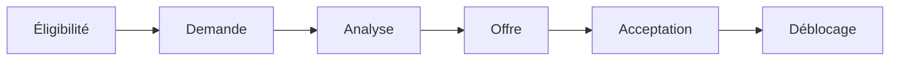

**Critères et Process :**

1. **Éligibilité Automatique**
   - 3+ mois d'activité
   - Note moyenne > 4.0
   - Taux acceptation > 85%
   - Revenus réguliers

2. **Types de Crédit**
   - **Avance Trésorerie :**
     * Jusqu'à 50% revenus moyens
     * Remboursement 7-30 jours
     * Taux : 5-10%
   
   - **Investissement :**
     * Équipement/Rénovation
     * Jusqu'à 3x revenus mensuels
     * Remboursement 3-12 mois
     * Taux : 12-18% annuel

3. **Remboursement**
   - Prélèvement automatique
   - Sur revenus futurs
   - Flexible si difficultés
   - Pas de pénalités cachées

---

## 📊 Module Analytics Pro

### 🎯 Parcours : Analyse Performance

**Métriques Disponibles :**

1. **Vue d'Ensemble**
   - Revenus : Courbes jour/semaine/mois
   - Commandes : Volume et valeur
   - Performance : vs objectifs
   - Comparaison : vs concurrence zone

2. **Analyses Détaillées**
   - **Produits/Plats :**
     * Top ventes
     * Marges par item
     * Vitesse rotation
     * Corrélations
   
   - **Clients :**
     * Nouveaux vs Récurrents  
     * Valeur vie client
     * Zones géographiques
     * Préférences
   
   - **Opérations :**
     * Temps service moyen
     * Taux erreur
     * Productivité heures
     * Coûts par commande

3. **Recommandations IA**
   - "Augmentez prix Plat X de 500F"
   - "Promouvez Article Y le mardi"
   - "Recrutez livreur zone Nord"
   - "Stock bas prévu dans 3 jours"

---

## 🛡️ Module Support Pro

### 🎯 Parcours : Résolution Problème

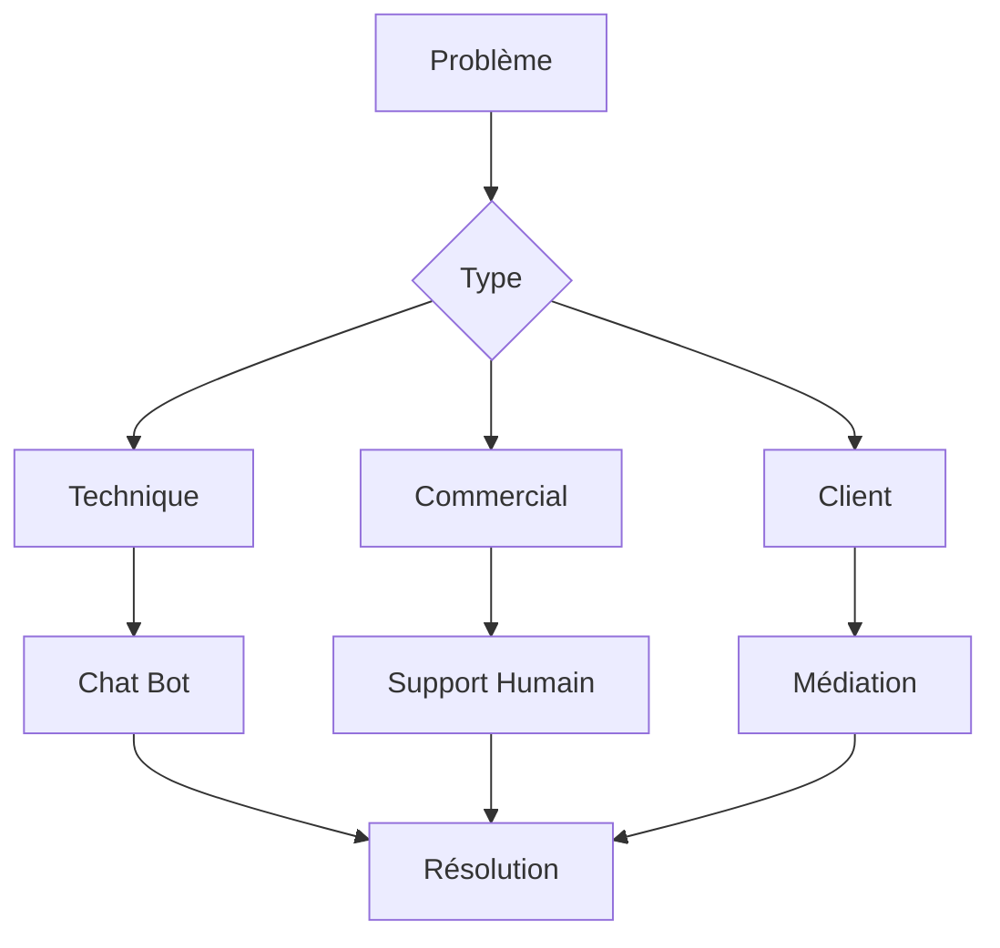

**Canaux Support :**

1. **Assistance Immédiate**
   - Chat bot 24/7
   - FAQ interactive
   - Tutoriels vidéo contextuels
   - Communauté entraide

2. **Support Humain**
   - Priorité selon statut (Bronze/Argent/Or)
   - Temps réponse : 2h max
   - Expertise métier
   - Suivi jusqu'à résolution

3. **Centre de Ressources**
   - Guides PDF téléchargeables
   - Webinaires mensuels
   - Meilleures pratiques
   - Cas d'usage réussis

---

## 🏆 Programme Partenaire Premium

### Avantages Progressifs

| Niveau | Critères | Avantages |
|--------|----------|-----------|
| **Bronze** | Actif 1+ mois | Commission -1%, Support priorité |
| **Argent** | Note 4.3+, 100+ commandes/mois | Commission -2%, Badge app, Formation avancée |
| **Or** | Note 4.5+, 300+ commandes/mois | Commission -3%, Publicité gratuite, Account manager |
| **Platine** | Top 1% zone, 6+ mois Or | Commission -5%, Co-marketing, Crédits privilégiés |

---

## 📱 Spécifications Techniques

### Configuration Minimale
- Android 5.0+ / iOS 11+
- RAM : 2GB minimum
- Stockage : 200MB
- Internet : 3G minimum
- GPS : Requis pour livreurs

### Mode Hors Ligne
- Consultation commandes
- Modification menu/stock  
- Accumulation actions
- Synchro au retour réseau

### Sécurité
- Authentification double facteur
- Sessions sécurisées
- Données cryptées
- Audit logs complets

---

## 🚀 Roadmap Fonctionnalités

### Q1 2025
- Voice commerce
- Réalité augmentée menus
- Paiements crypto

### Q2 2025  
- IA prédictive demande
- Intégration ERP
- Multi-succursales

### Q3 2025
- API ouverte
- Marketplace B2B
- Franchise digitale

---

*Documentation Application Prestataire - Version 1.0*